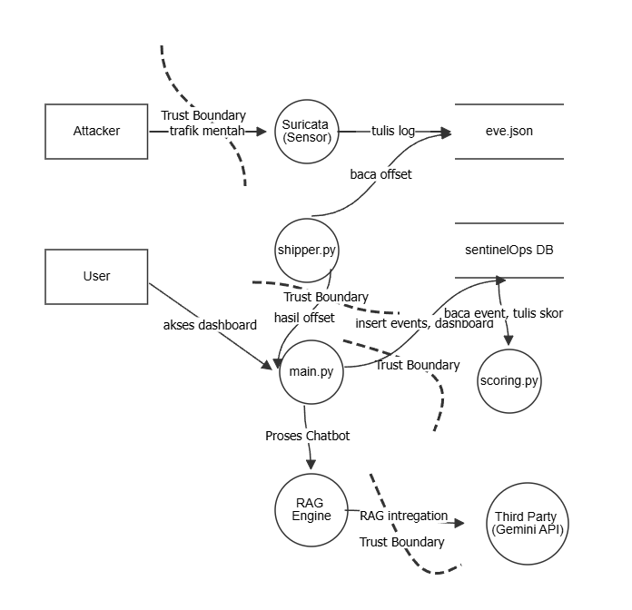

# SentinelOps — Threat Model (STRIDE)

## 1. Ruang Lingkup & Metodologi

Dokumen ini menganalisis arsitektur SentinelOps menggunakan metodologi **STRIDE**
(Spoofing, Tampering, Repudiation, Information Disclosure, Denial of Service, Elevation of
Privilege). Analisis dilakukan per komponen dan per alur data, dengan merujuk langsung pada
kode yang telah dibangun tim (`shipper.py`, `security.py`, `db.py`, `main.py`).

## 2. Batas Kepercayaan (Trust Boundaries)

1. **Jaringan luar (attacker) ↔ VM utama (Suricata).** Batas terluar sistem — apa pun yang
   berasal dari sisi attacker tidak boleh diasumsikan aman.
2. **`agent/shipper.py` ↔ `api/main.py`.** Meski berpotensi berjalan di mesin yang sama, ini
   tetap batas proses-ke-proses melalui HTTP dan harus diperlakukan sebagai tidak tepercaya
   secara default.
3. **`api/main.py` ↔ Dashboard (Laravel) / pengguna.** Batas publik-facing — siapa pun yang
   bisa mengakses API melalui jaringan dianggap sebagai penyerang potensial.
4. **`api/main.py` (RAG) ↔ Gemini API (eksternal).** Data yang dikirim ke sini sepenuhnya
   meninggalkan infrastruktur tim dan masuk ke pihak ketiga (Google).

## 3. Diagram Arsitektur & Alur Data

Diagram berikut menggambarkan alur data end-to-end beserta keempat batas kepercayaan di
atas — mulai dari trafik mentah attacker, proses Suricata, pengiriman log oleh
`shipper.py`, penyimpanan di SentinelOps DB, hingga interaksi pengguna dengan dashboard dan
RAG Engine/Gemini API.

## 4. Analisis STRIDE per Komponen

### 4.1 `eve.json` (log Suricata)

| STRIDE | Ancaman | Mitigasi Saat Ini | Risiko Tersisa / Rekomendasi |
|---|---|---|---|
| Tampering | File dihapus atau di-*truncate* manual sehingga bukti hilang. Insiden ini pernah benar-benar terjadi saat pengumpulan dataset (lihat `docs/dataset.md`, bagian *Lessons Learned*) | Prosedur operasional: dilarang truncate manual, file dibiarkan terus mengalir | Belum ada proteksi teknis (mis. write-once/append-only, hash chaining) — murni bergantung pada disiplin operasional. Untuk produksi, pertimbangkan log forwarding real-time yang tidak menyisakan file lokal berukuran besar |
| Information Disclosure | File berisi topologi jaringan lengkap (IP, port terbuka) | Permission file dibatasi ke user tertentu | Jika permission salah konfigurasi (pernah terjadi: sempat `root`-only, lalu perlu di-`chmod`), risiko under- atau over-exposure tetap ada |

### 4.2 `agent/shipper.py` (klien pengirim data)

| STRIDE | Ancaman | Mitigasi Saat Ini | Risiko Tersisa / Rekomendasi |
|---|---|---|---|
| Spoofing | Proses lain menyamar sebagai shipper resmi dan mengirim event palsu ke `/ingest` | HMAC-SHA256 signing — hanya pemegang secret yang bisa membuat signature valid (diverifikasi di `security.py`, teruji pada 7 skenario) | Jika secret bocor (mis. ter-commit ke git atau terekam di shell history), proteksi ini hilang total. Rekomendasi: gunakan `.env` yang di-*gitignore* dan rotasi secret secara berkala |
| Tampering | Isi event diubah di tengah jalan (*man-in-the-middle*) | HMAC menutupi seluruh body — perubahan sekecil apa pun membuat signature tidak cocok dan otomatis ditolak | HMAC menjamin **integritas**, bukan **kerahasiaan** — koneksi masih HTTP polos sehingga isi tetap bisa disadap meski tidak bisa diubah tanpa terdeteksi. Rekomendasi: gunakan HTTPS/TLS untuk deployment produksi |
| Denial of Service | Shipper (atau pihak yang menyamar dengan secret bocor) mengirim batch besar terus-menerus | Belum ada mitigasi | Rekomendasi: rate limiting di `/ingest` dan batas ukuran payload |

### 4.3 `api/security.py` (verifikasi HMAC)

| STRIDE | Ancaman | Mitigasi Saat Ini | Risiko Tersisa / Rekomendasi |
|---|---|---|---|
| Tampering | Timing attack untuk menebak signature yang benar byte demi byte | `hmac.compare_digest()` (constant-time comparison), bukan operator `==` biasa | Sudah sesuai standar industri; risiko rendah |
| Repudiation / Replay | Request valid yang disadap lalu diputar ulang (*replay*) oleh penyerang | Dua lapis mitigasi: (1) jendela waktu 300 detik, (2) cache in-memory yang menolak signature identik yang dipakai dua kali — teruji eksplisit | Cache in-memory hanya berlaku untuk satu proses. Jika API dijalankan multi-worker/multi-instance, proteksi replay antar-instance melemah karena satu instance tidak tahu signature yang sudah diterima instance lain. Dicatat sebagai keterbatasan yang disengaja untuk skala prototipe |
| Elevation of Privilege | Secret default development (`dev-secret-ganti-di-production`) terpakai tanpa disadari saat demo | Warning otomatis dicetak ke log jika environment variable belum di-set | Tetap bisa lolos jika tidak ada yang memeriksa log. Rekomendasi: gagal keras (*refuse to start*) pada mode production, bukan sekadar warning |

### 4.4 `api/db.py` (SQLite)

| STRIDE | Ancaman | Mitigasi Saat Ini | Risiko Tersisa / Rekomendasi |
|---|---|---|---|
| Tampering | SQL injection melalui input apa pun (nama host, dsb.) | Seluruh query di-*parameterize*, tanpa penggabungan string SQL — sudah diuji eksplisit dengan payload berbahaya (`' OR '1'='1`, `'; DROP TABLE`) | Risiko rendah selama disiplin ini dipertahankan pada kode baru yang ditambahkan ke depan |
| Information Disclosure | File `.db` dapat dibaca siapa pun yang punya akses filesystem | Belum ada pembatasan eksplisit selain permission OS default | Tidak dienkripsi *at rest*. Untuk tahap prototipe/demo, risiko ini diterima dan dicatat sebagai future work |
| Denial of Service | Tabel `events` tumbuh tanpa batas seiring waktu | Belum ada strategi pruning/retention | Di luar cakupan pengembangan 2 minggu; dicatat sebagai future work, bukan diabaikan |

### 4.5 `api/main.py` — endpoint publik (`/assets`, `/assets/{ip}`, `/timeline`, `/chat`)

| STRIDE | Ancaman | Mitigasi Saat Ini | Risiko Tersisa / Rekomendasi |
|---|---|---|---|
| Spoofing / Elevation of Privilege | Endpoint-endpoint ini **tidak memiliki autentikasi sama sekali** — hanya `/ingest` yang diproteksi HMAC | Belum ada mitigasi | **Ini gap paling signifikan dan perlu diakui secara eksplisit.** Siapa pun yang dapat menjangkau API melalui jaringan bisa melihat seluruh skor risiko dan topologi. Untuk demo di jaringan terisolasi risikonya rendah, namun autentikasi (API key/session) wajib ditambahkan sebelum sistem dianggap siap produksi |
| Information Disclosure | `/assets` dan `/timeline` membocorkan IP internal dan status keamanan jaringan pengguna kepada siapa pun yang bisa mengaksesnya | Hanya terlindungi oleh isolasi jaringan lab, bukan oleh kode aplikasi | Perlu autentikasi pada level aplikasi — isolasi jaringan saja tidak cukup diandalkan |
| Denial of Service | Endpoint baca (`/assets`, `/timeline`) dapat dibanjiri request | Belum ada rate limiting | Di luar cakupan Tier 1/2 saat ini; dicatat untuk iterasi berikutnya |

### 4.6 RAG Engine + Gemini API (eksternal)

| STRIDE | Ancaman | Mitigasi Saat Ini | Risiko Tersisa / Rekomendasi |
|---|---|---|---|
| Information Disclosure | Query pengguna (berpotensi memuat detail jaringan internal) dikirim ke API pihak ketiga (Google Gemini) | Belum ada penyaringan konten sebelum data dikirim | Tim perlu memutuskan secara sadar: batasi konteks yang dikirim ke LLM hanya pada deskripsi teknis umum (SID, signature), bukan IP/hostname mentah, jika kerahasiaan menjadi perhatian |
| Tampering (Prompt Injection) | Pengguna menyusun pertanyaan yang dirancang untuk memanipulasi LLM agar keluar dari perannya (mis. meminta LLM mengabaikan instruksi sistem) | Temperature rendah (0.1) membuat output lebih kaku/faktual, namun ini **bukan** proteksi prompt injection yang sesungguhnya | Belum ada validasi/sanitasi input eksplisit. Rekomendasi minimal: batasi panjang query dan log seluruh interaksi chat untuk keperluan audit |
| Denial of Service (biaya) | `/chat` dipanggil berulang kali sehingga menghabiskan kuota/biaya API Gemini | Belum ada mitigasi | Rekomendasi: rate limit khusus pada endpoint `/chat`, lebih ketat dibanding endpoint lain karena ada biaya nyata per panggilan |

### 4.7 Dashboard (Laravel)

| STRIDE | Ancaman | Mitigasi Saat Ini | Risiko Tersisa / Rekomendasi |
|---|---|---|---|
| Tampering (XSS) | Teks `reason`/`signature` dari database dirender mentah di halaman, berpotensi disalahgunakan jika ada cara menyisipkan HTML/JS ke dalamnya | Blade (Laravel) melakukan escape otomatis melalui `{{ }}` selama tidak digunakan `{!! !!}` | Perlu dipastikan tidak ada satu pun output yang menggunakan `{!! !!}` untuk data yang bersumber dari `events`/`hosts` |
| Spoofing | Belum jelas apakah dashboard memiliki login/sesi pengguna | Belum dikonfirmasi | Perlu koordinasi dengan tim dashboard — jika dashboard menampilkan data sensitif tanpa login sama sekali, ini memperberat gap pada bagian 4.5 |

## 5. Ringkasan: Mitigasi yang Sudah Ada

- HMAC-SHA256 signing pada `/ingest`, dengan constant-time comparison — teruji pada 7 skenario
- Replay protection nyata (bukan sekadar pengecekan waktu) — signature yang dipakai ulang ditolak
- Parameterized query di seluruh `db.py` — teruji tahan terhadap payload SQL injection
- Validasi terpusat di boundary sistem (endpoint `/ingest`), bukan tersebar di berbagai tempat
- Prosedur operasional terdokumentasi (`docs/dataset.md`) hasil dari insiden nyata selama
  pengembangan (truncate log), bukan asumsi teoretis

## 6. Ringkasan: Risiko yang Belum Dimitigasi

1. Endpoint `/assets`, `/assets/{ip}`, `/timeline`, `/chat` tidak memiliki autentikasi
2. Belum ada HTTPS/TLS — HMAC menjamin integritas, bukan kerahasiaan
3. Belum ada rate limiting pada endpoint mana pun
4. `sentinelops.db` tidak dienkripsi *at rest*
5. Replay protection hanya berlaku untuk single-process (belum siap multi-instance)
6. Belum ada penanganan eksplisit untuk prompt injection pada `/chat`

Keenam poin di atas merupakan keputusan sadar untuk memprioritaskan cakupan Tier 1 dalam
waktu pengembangan yang terbatas — bukan kelalaian yang tidak disadari. Transparansi ini
yang membedakan threat model yang jujur dari klaim "sudah aman" tanpa analisis pendukung.
